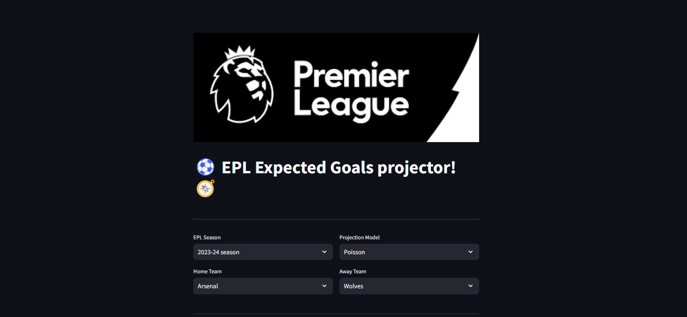

# EPL Expected Goals Projector



This project aims to predict football match outcomes for English Premier League (EPL) matches using various machine learning models. It provides a web application built with Streamlit that allows users to input a home and away team and receive projected scores based on historical data and statistical analysis.

## Features

### Data Collection and Processing
- Collects historical EPL match data from CSV files
- Processes and cleans the data to create relevant statistics
- Calculates cumulative results, goal statistics, and league positions for each team

### Machine Learning Models
- Implements three prediction models:
  - Poisson Distribution
  - Random Forest Regressor
  - XGBoost Regressor
  - Ensemble model combining RF and XGBoost

### Web Application
- Built with Streamlit for an interactive user interface
- Allows users to select:
  - EPL season
  - Prediction model
  - Home and away teams
- Displays projected scores, win probabilities, and actual scores (if available)
- Shows root mean square error for predictions

## How It Works

1. Data Preparation:
   - Loads historical EPL match data from CSV files
   - Preprocesses the data to extract relevant features
   - Calculates cumulative statistics like wins, draws, losses, points, goals, etc.

2. Feature Selection:
   - Identifies the most correlated features for home and away goals
   - Uses these features for predictions

3. Model Training:
   - Trains separate models for home and away goals
   - Implements ensemble model for combined predictions

4. Prediction:
   - When a match is selected, the system retrieves the relevant historical data
   - Runs the chosen model(s) to generate predictions
   - Calculates win probabilities (for Poisson model)

5. Visualization:
   - Displays projected scores and win probabilities
   - Shows actual scores and RMSE if the match has occurred
   - Provides links to GitHub repository and data source

## Installation

To run this project locally:

1. Clone the repository:
```
git clone https://github.com/TheODDYSEY/EPL-Predictor.git
```

2. Install required libraries:
```
pip install -r requirements.txt
```

3. Ensure you have the necessary CSV files in the `engg_data` directory

4. Run the Streamlit app:
```
streamlit run app.py
```

## Usage

1. Open a web browser and navigate to the URL where the Streamlit app is running
2. Select the desired EPL season from the dropdown menu
3. Choose a prediction model (Poisson, RandomForest, XGBoost, or Ensemble)
4. Select the home and away teams from the dropdown menus
5. Click "Run" to see the predicted scores and other information

## Contributing

Contributions are welcome! Please feel free to submit pull requests or issues through the GitHub repository.

## License

This project is licensed under the MIT License - see the LICENSE.md file for details.

## Acknowledgments

- Football-Data.org for providing historical EPL match data
- Streamlit for the web framework
- Scikit-learn and XGBoost for machine learning algorithms